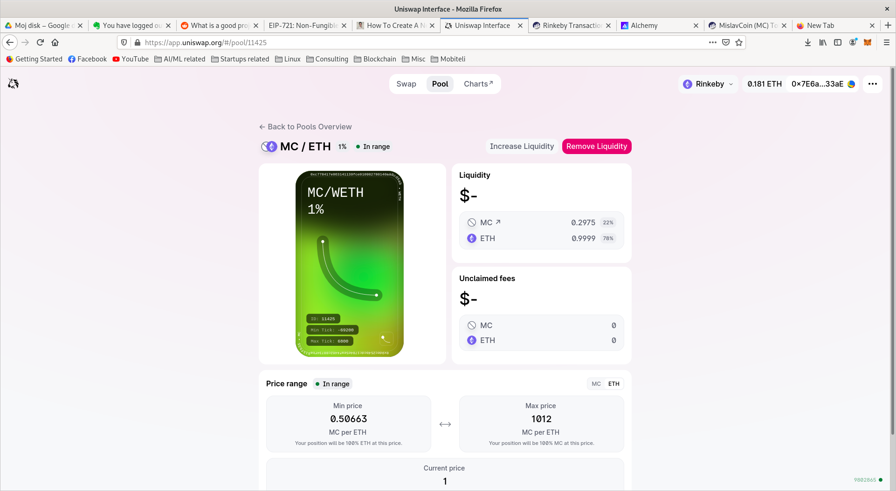

# MislavCoin

MislavCoin is an ERC-20 token I implemented. The intention was to familiarize myself with the blockchain development related tools and I think the project served its purpose. 

During the project, I familiarized myself with how to:

- develop smart contracts in Solidity (paying attention to code quality and security)
- use development tools such as Hardhat, Truffle and Ganache
- test my smart contracts locally
- write tests for smart contracts
- write deployment scripts for smart contracts
- deploy smart contracts to testnets
- create a Uniswap liqudity pool (pictured below)

Below I give a list of some of the files in this repository and their descriptions.

## File descriptions

- **contracts/extensions** - Metadata extension for the ERC20 token standard
- **contracts/IERC20.sol** - ERC20 interface
- **contracts/MislavCoinDEX.sol** - a simple decentralized exchange implementation
- **contracts/MislavCoinSupply.sol** - a simple MislavCoin supply
- **contracts/MislavCoinv1.sol** - my first attempt at implementing the ERC20 token standard; the main thing I couldn't understand from the [ERC20 token standard](https://eips.ethereum.org/EIPS/eip-20) was how the *transferFrom* method should work, as I document in the *TODO* in *transferFrom*
- **contracts/MislavCoinv2.sol** - my second attempt at implementing the ERC20 token standard with the help of the [Ethereum tutorial](https://ethereum.org/en/developers/tutorials/understand-the-erc-20-token-smart-contract/)
- **contracts/MislavCoinv3.sol** - my third attempt at implementing the ERC20 token standard based on [OpenZeppelin's ERC20 implementation](https://github.com/OpenZeppelin/openzeppelin-contracts/blob/master/contracts/token/ERC20/ERC20.sol)
- **contracts/MislavCoinVestingv1.sol** - my first attempt at implementing a vesting schedule
- **contracts/utils** - some utility methods
- **MislavCoinv3_and_MislavCoinSupply_Rinkeby_address.txt** - this text file contains the address of the MislavCoinv3 and the MislavCoinSupply contract on the Rinkeby testnet, as well as the link to the relevant Etherscan
- **scripts/deploy.js** - a script I used for deploying the contracts to the testnet
- **test** - a folder containing the tests for the contracts from the **contracts** folder
